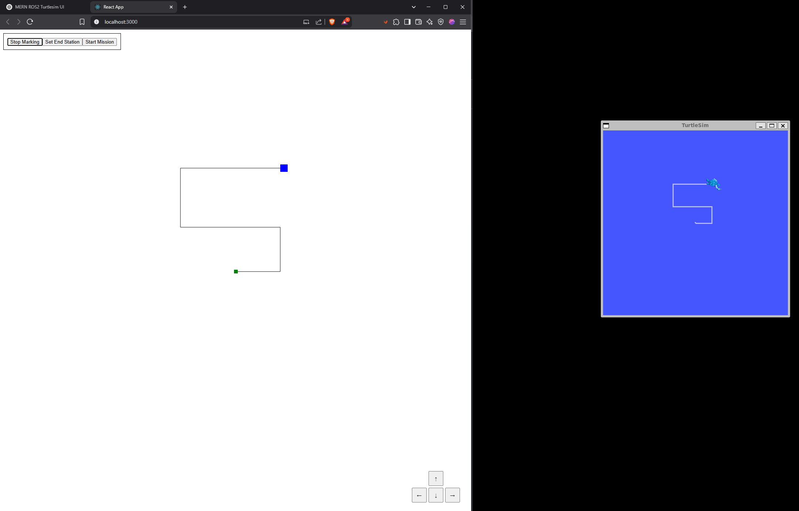

# MERN + ROS2 Turtlesim Controller

This project is a **MERN (MongoDB, Express, React, Node.js)** application that integrates with **ROS2 Humble** to control the classic `turtlesim` robot.

**Real-time movement with arrow keys / buttons**  
**Marking mode to record paths**  
**Start + end stations for mission runs**  
**Save marked paths to MongoDB**  
**WebSocket-based instant sync between UI and ROS2**

---

##  Demo Screenshot

---

## Architecture Overview
React Frontend (Canvas + WebSocket)
 - ws://localhost:8080

Node.js Express + WebSocket Backend
 - ROS2 rosbridge (ws://localhost:9090)
 - MongoDB Atlas/local (for saving paths)

 **Frontend**  
  A React app with a full-screen canvas, blue square, arrow buttons, and control panel.
  
 **Backend**  
  Express server that:
  - Hosts a WebSocket server to talk to frontend
  - Connects to ROS2 via `rosbridge_server`
  - Exposes a REST API endpoint to save marked paths into MongoDB
  
 **ROS2 Layer**  
  Uses `rosbridge_websocket` to let Node.js call ROS services (like `teleport_absolute`) to move the turtle in `turtlesim`.

---

## Setup

### Prerequisites

- ROS2 Humble (on Linux or WSL2 Windows)
- `rosbridge_server` ROS package installed (`sudo apt install ros-humble-rosbridge-server`)
- Node.js (v18+)
- MongoDB (local or Atlas cloud)

---

### Backend Setup

1️. Clone the project and go to backend folder:
cd backend

2. Install dependencies
npm install

3. Create a .env file:
MONGO_URI=your_mongodb_connection_string
DATABASE_NAME=your_database_name
COLLECTION_NAME=paths

4. Start ROS WebSocket bridge (in a separate terminal):
ros2 launch rosbridge_server rosbridge_websocket_launch.xml

5. Start turtlesim (in another separate terminal):
ros2 run turtlesim turtlesim_node

6. Run the backend server: 
node index.js
Backend runs on: http://localhost:8080

### Frontend Setup
1️. Go to the frontend folder:
cd frontend

2. Install dependencies:
npm install

3. Start the React app:
npm start
Frontend runs on: http://localhost:3000

